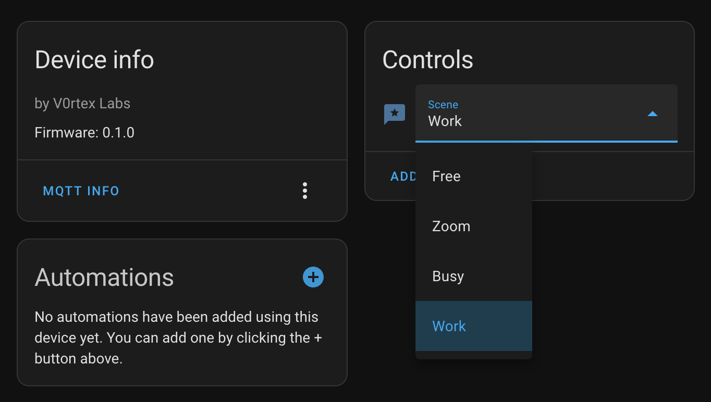

# HA Status Display

**NOTE:** This project is a work-in-progress currently

Have you ever needed a way to let your cohabitants know when they are allowed to bother you while working? I sure do! Since I am primarily working from home these days I have grown frustrated by people knocking on my office door while I am in meetings or when I'm hyperfocusing on something. In researching good ways to solve this problem I originally thought maybe I should just get a remotely controllable light that I can mount somewhere outside my office door to let people know if it's safe to
bother me or not. That could work but it does have a few limitations:

  1. If it's only a single color then I can only communicate a single status of "busy" or "not busy" (light on or off respectively)
  2. If it's an RGB light maybe I can solve the above by choosing different colors to mean different statuses... _but_ then what if a potential interrupting individual doesn't know what the colors mean?
  3. I want to control it via some sort of automation... so I'd already have to get some sort of microcontroller. Simply controlling a single light seems like a bit of a waste for that
  4. It might not look cool

What can we do about that? Well... I remembered seeing some RGB displays you could buy that are cusomizable so I went looking at options for something like that. I thought maybe I could have it show a message indicating my current status. But the options I found - while nice looking - were mostly all quite expensive, didn't have enough pixels for the types of things I was imagining, and/or required using some random app that probably would be difficult to integrate into my home automation. So I kept digging and found some pretty inexpensive RGB matrix panels for around $30. I decided that was low cost enough that it would be worth trying to make work. Armed with some high-level research on how to connect them to an ESP board I went ahead and bought a 32x64 panel, a 5V power adapter, and already had a pile of cheap ~$3 D1 Mini clones leftover from ESPHome projects I've been working on. These basic building blocks can be had for under $40 - $50... and I get to build something!

## Parts list

  * 32x64 RGB LED panel
  * Power adapter
  * ESP8266 board

## Building the panel

I initially had a hard time following some of the wiring diagrams I found online because they didn't all agree with each other. It seems there can be small variations depending on which matrix panel you get. I finally got things working after following [Brian Lough's guide](https://www.instructables.com/RGB-LED-Matrix-With-an-ESP8266/) as well as some other wiring guides I found. The main problem I ran into was that I had connected a wire that I shouldn't have and so it wouldn't come on at first. Once I figured that out it was good to go. Ultimately I would love to get a board like Brian Lough sells on Tindie but his store is currently on hold as of the time of me composing this README so a mess of wires will have to do for now.

## Firmware

The next step, of course, is making the panel actually display something useful. The main library for handling all of the work of rendering content to the display is called PxMatrix. Once I fired that up and followed a basic example I was up and running showing some text on the display. Once I saw the power of what I could do I put a ton of work into trying to make something both useful and nice looking.

## Features

Here is a basic outline of what I built in this sketch so far:
  * A startup logo that renders a low-res version of the Home Assistant icon that I adapted
  * Captive portal for WiFi setup rather than relying on hardcoded credentials in the sketch
  * A collection of icons I designed pixel-by-pixel on graph paper and entered by hand in the code for rendering nice-looking statuses on the display (this took awhile)
  * A concept of a "Scene" that is rendered for a given status - composed of a border color, an icon, and a name/label
  * 4 scenes I've made so far (these fit my use cases but maybe won't fit yours) - "Free", "Zoom", "Busy", "Work"
  * Fade-in and fade-out effect for the scenes
  * Non-blocking code everywhere possible so that even the config/web portal runs quick and smooth
  * Custom configuration parameters in the web portal (accessible initially via the captive portal and later via it's IP on the network) for telling it where to connect to an MQTT broker
  * Automatic configuration in Home Assistant if you have the MQTT integration set up and pointing to the same MQTT broker as the status sign

## See it in action

The pictures really did a terrible job of reproducing the actual brightness of the display... just know that the colors look way better in person than in these photos

In Home Assistant you can control the device with a simple select (dropdown) control. This opens it up to all of the potential automations you might want to do. In my case I am going to set up a few things to detect when I'm present in my office during normal work hours combined with some other things like zoom meeting status (using and integration that works with Zoom's webhooks), and possibly calendar events.

